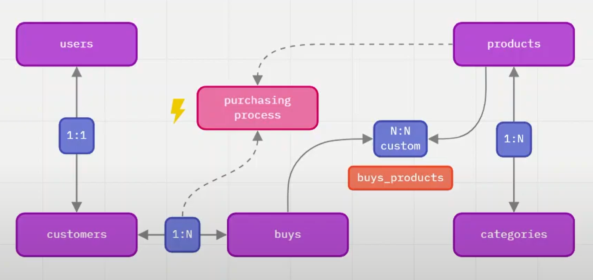
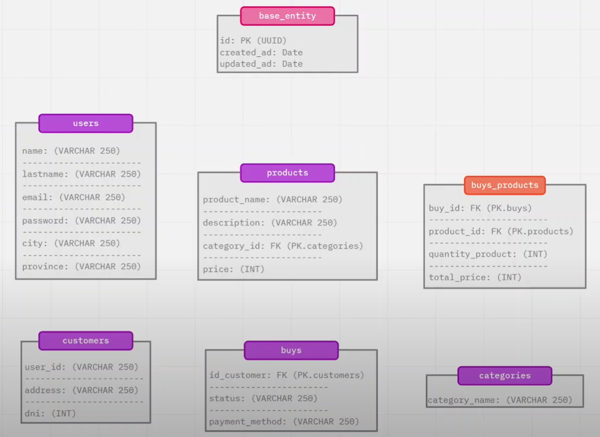

# Arquitectura y Relaciones de Entidades - Parte 1

Vamos a reorganizar nuestro proyecto de la siguiente manera: Por cada entidad tendremos un directorio con el nombre de la misma, y dentro se encontraran los controladores, entidades y router respectivo a cada entidad. Para los módulos o directorios comunes, creamos una carpeta destinada llamada `shared`.

## Entidad-Relación

Tenemos un modelo basado en un e-commerce:

<table style="width: 100%">
    <tr>
        <td style="width: 33%">
            <a href="./P4T1_Docker_Compose_TypeORM.md">Docker Compose y TypeORM</a>
        <td>
        <td align="center" style="width: 33%">
            <a href="../README.md">README</a>
        <td>
        <td align="right" style="width: 34%"><td>
    </tr>
</table>
